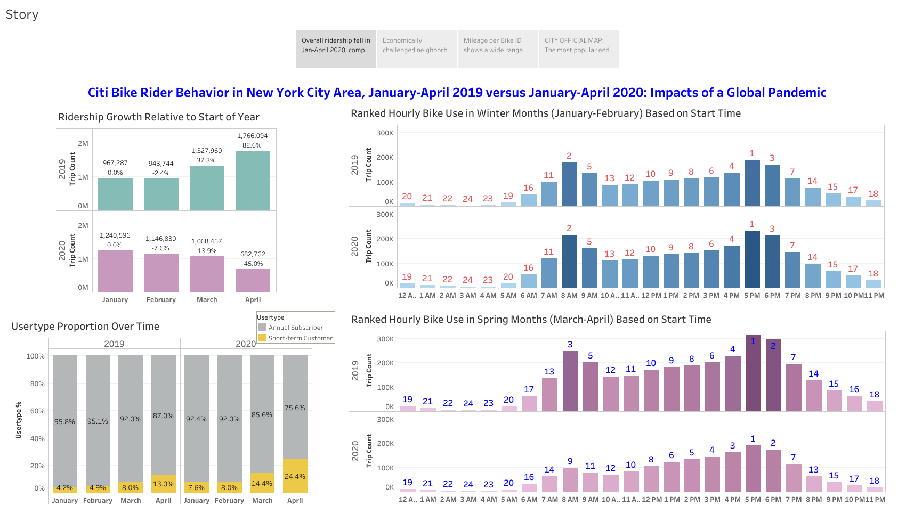
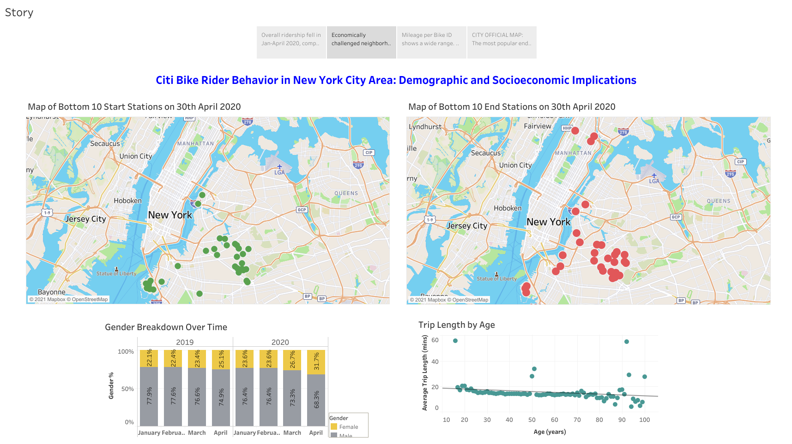
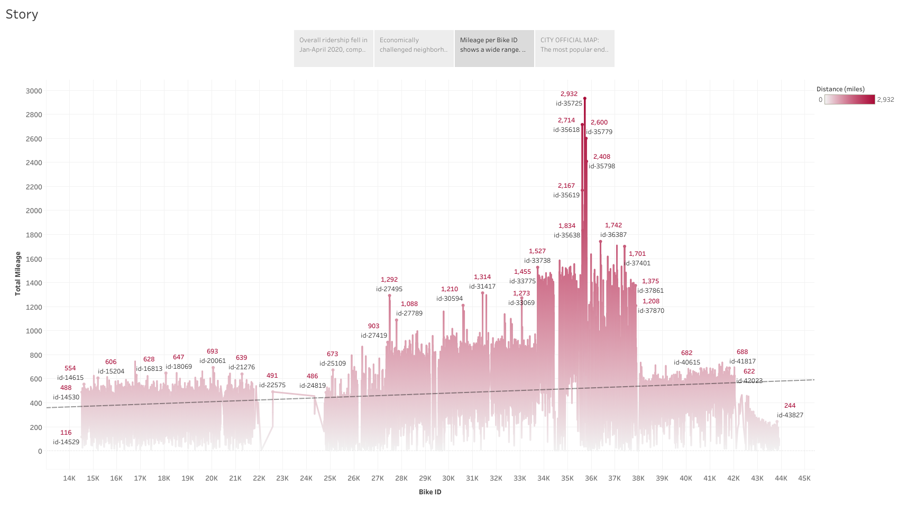
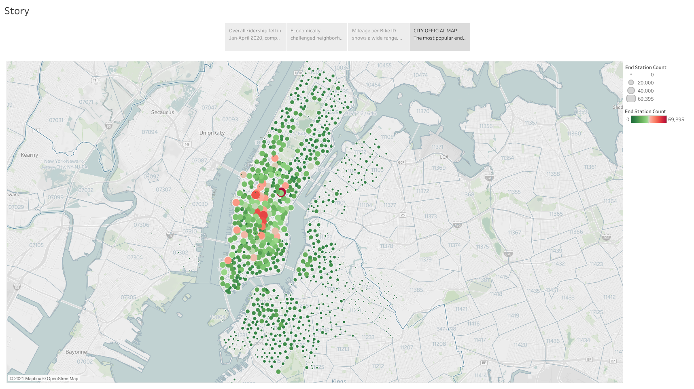

# Tableau Challenge

## Citi Bike Rider Behavior in New York City - Impacts of a Global Pandemic

In this study, Citi Bike rider behavior was analyzed in the New York City area using Tableau. A couple of time periods separated in time were chosen, each covering a span of 4-months: January-April 2019 and January-April 2020. The aim was to be able to analyze monthly trends, as well as yearly trends in New York City with the expectation of seeing the impact of a black swan event like the Covid-19 global pandemic.

## Table of Contents

* Data folder containing CSVs of data used.
* Images folder containing screenshots of Tableau story.
* The entire story can be accessed [here](https://public.tableau.com/profile/amy.banerji#!/vizhome/CitiBikeAnalytics_15979089569340/Story) on Tableau Public.

## Tableau Story Screenshots

**Compared to the same period in 2019, the following trends are revealed for 2020 by the plots above:**
* Overall ridership fell. 
* Casual customer to annual subscriber ratio rose sharply as riders probably did not want to enter long term commitments.
* A reduction in bike rides occured, and impacts of altered work hours are seen when compared to usual morning commute hours from 2019.

 
 

**Compared to the same period in 2019, the following trends are revealed for 2020 by the plots above:**
* Economically challenged neighborhoods like Harlem, or even lower cost areas such as Brooklyn showed the least used Start and End Stations amidst the pandemic. A few possible causes could be greater loss of jobs, distance from popular points of interest, indifference to health benefits of biking, and overall reduced transportation needs. 
* Proportion of female riders increased over time, which could be an effect of increased community outreach, or related to fewer job losses for women in the spring of 2020. 
* In general, younger riders biked for ~15-20 mins, which reduced to ~10-mins on average for older riders likely due to health issues. 

 
 

**Mileage per Bike ID**
* Mileage per Bike ID shows a wide range. From zero or a few miles on some bikes, to a couple of thousands on others -- the latter likely requiring more repair/inspections for upkeep.

 
 

**City Official Map**
* The most popular end stations are located in the heart of Manhattan, where people flock either for business, or to get to the many points of interest -- all interconnected by a robust underground Subway system that is easily accessible by riders. Since the lower cost areas in the north and east often do not provide well paying job or tourism opportunities, fewer riders end trips in these areas. 

 
 

## Technologies
* Tableau

## Contact
Created by [@iCode13](https://github.com/iCode13) - please contact with questions/comments.

